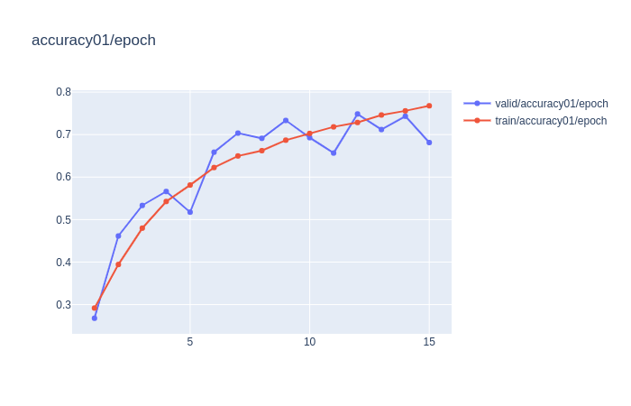
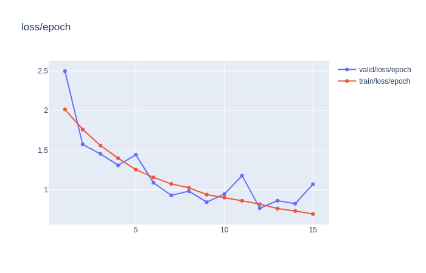
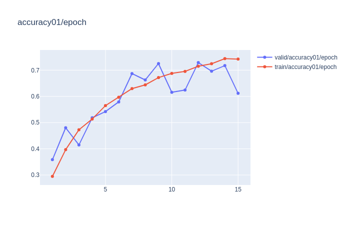
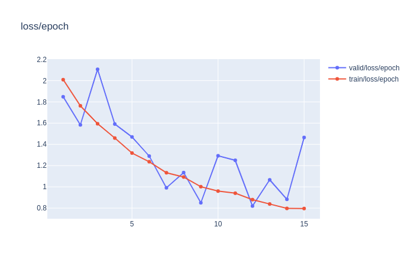
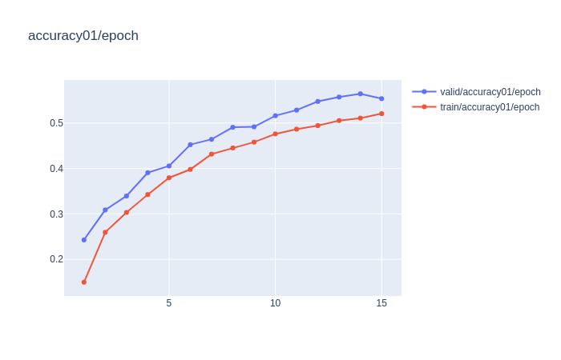
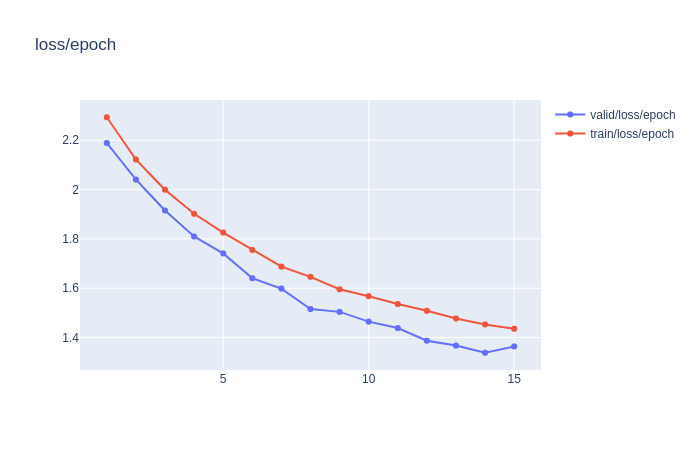

# Training-BatchNorm-and-Only-BatchNorm_pytorch
Training-BatchNorm-and-Only-BatchNorm pytorch

dataset : https://github.com/fastai/imagenette

1) Train resnet18 
 ```
python .py
```



2) Train resnet18 without batchnorm 




3) Train resnet18 only batchnorm





# Citation

```
@article{
  title={Training BatchNorm and Only BatchNorm:On the Expressive Power of Random Features in CNNs},
  author={Jonathan Frankle, David J. Schwab , Ari S. Morcos},
  journal={arXiv preprint arXiv:2003.00152},
  year={2020}
}