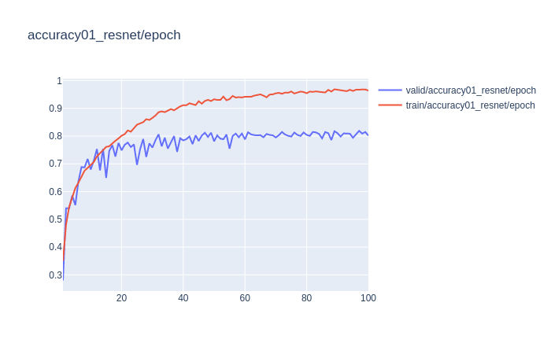
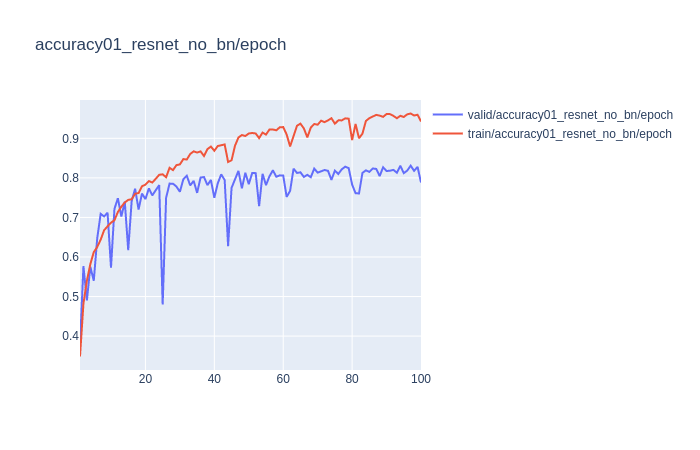
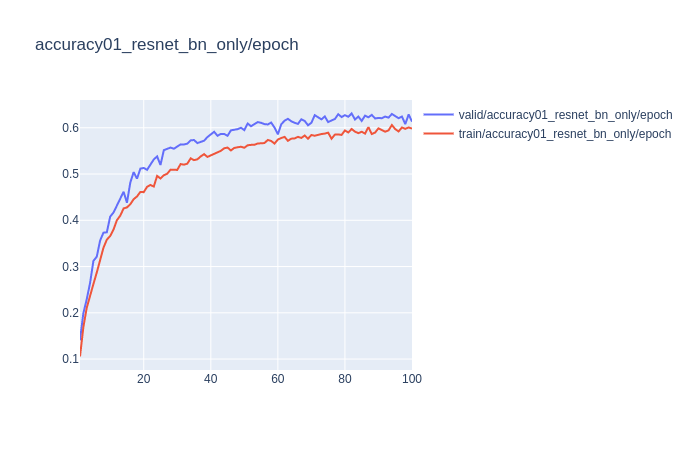
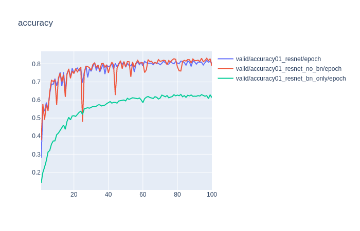
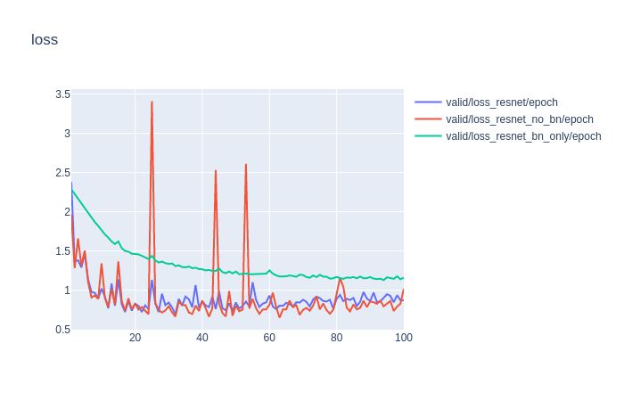

# Training-BatchNorm-and-Only-BatchNorm_pytorch
Training-BatchNorm-and-Only-BatchNorm pytorch

dataset : https://github.com/fastai/imagenette
 ```
python train_loop.py
```
1) Train resnet18 

ResNet18 with an LR schedule and all the layers as trainable



2) Train resnet18 without batchnorm 
ResNet18 with an LR schedule and all the layers as trainable without batchnorm 



3) Train resnet18 only batchnorm

ResNet18 with an LR schedule and only  batchnorm layers trainable




Result:





Visualization:

visualization.ipynb


# Citation

```
@article{
  title={Training BatchNorm and Only BatchNorm:On the Expressive Power of Random Features in CNNs},
  author={Jonathan Frankle, David J. Schwab , Ari S. Morcos},
  journal={arXiv preprint arXiv:2003.00152},
  year={2020}
}